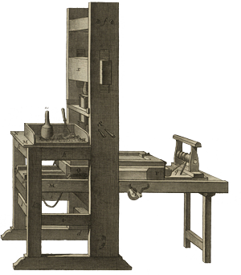
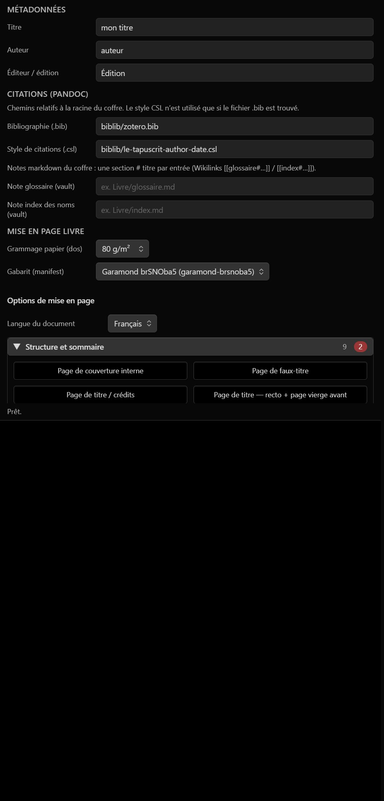
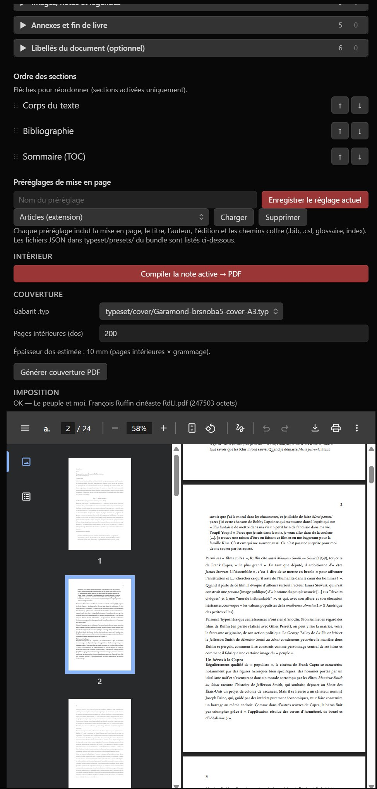
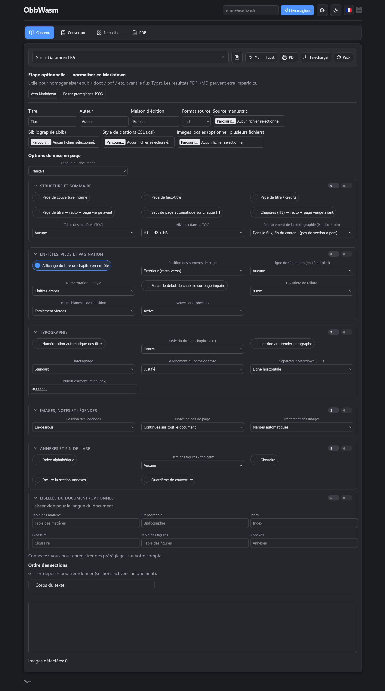

<div align="center">

<table>
<tr>
<td></td>
<td align="left">
<h1 style="margin:0">BookBrew</h1>
<p style="margin:0.25em 0 0"><strong>Studio für Buchgestaltung</strong><br/>Markdown → PDF · Pandoc WASM · Typst WASM · Obsidian-Plugin</p>
</td>
</tr>
</table>

<a href="https://atelier.atechnologie.fr/" title="l'Atelier – Verein für Buchherstellung und Forschungswerkzeuge"></a>  
<sub>Entwickelt von <a href="https://atelier.atechnologie.fr/">l'Atelier</a> — Buchherstellung und Forschungswerkzeuge (EHESS)</sub>

<p>
🇫🇷 <a href="README.md">Français</a> ·
🇬🇧 <a href="README.en.md">English</a> ·
🇩🇪 <a href="README.de.md"><b>Deutsch</b></a> ·
🇪🇸 <a href="README.es.md">Español</a>
</p>

<p>
<a href="https://atelier.atechnologie.fr/"></a>
<a href="https://github.com/Atelier-Recherche/obbwasm"></a>
<a href="https://obsidian.md/plugins?search=BRAT#"></a>
</p>

</div>

---

## 📸 Vorschau

| Layout-Optionen | PDF-Vorschau |
| :---: | :---: |
|  |  |

<p align="center">
<br/>
<sub>Web-App (React + Vite) — dieselbe WASM-Pipeline</sub>
</p>

---

## 📖 Über das Projekt

**BookBrew** (Repository `obbwasm`) ist ein Studio für Buchgestaltung und Druckvorbereitung mit einer **100 % WebAssembly**-Pipeline im Browser (und in Obsidian):

- 📝 Dokumentenkonvertierung über **Pandoc WASM**
- 📐 Satz mit **Typst WASM**
- 👁️ PDF-Vorschau über **pdf.js**
- 🌐 **React + Vite** Web-App und **Obsidian-Plugin** mit gemeinsamem Kern `@obbwasm/core`
- 🗄️ Optionale **PHP + JSON**-Hilfs-API (Projekte, Vorlagen, Voreinstellungen)

Für den Hauptworkflow sind keine lokale Pandoc- oder Typst-Installation nötig.

---

## ⬇️ Obsidian-Plugin (BRAT)

1. 🔌 **BRAT** installieren: [Obsidian — BRAT](https://obsidian.md/plugins?search=BRAT#)
2. ➕ Dieses Repository mit *„Add Beta plugin“* hinzufügen:  
   `https://github.com/Atelier-Recherche/obbwasm`  
   (Plugin-Ordner: `obsidian-plugin/` — Release-Workflow für `main.js`, `manifest.json`, `styles.css`, WASM)

3. 📥 **Typst-Vorlagen** in den Plugin-Einstellungen herunterladen (oder lokalen `typeset/`-Ordner angeben).

> 💡 Aktive Markdown-Notiz kompilieren → Innen-PDF, Umschlag, Imposition; Layout-Voreinstellungen; Glossar und Namensindex.

---

## ⚙️ Funktionsweise

| Komponente | Aufgabe |
| --- | --- |
| **Pandoc WASM** | Markdown (+ `.bib`-Bibliographie / CSL) → Typst |
| **Typst WASM** | `typeset/`-Vorlagen (Garamond, Imposition, Umschlag) → PDF |
| **Medien** | Lokale Bilder, Remote-URLs (WebP → PNG), extrahierte Base64-Bilder |
| **Plugin** | Obsidian-Tresor, JSON-Voreinstellungen, größenverstellbare PDF-Vorschau |

📱 Das Plugin richtet sich an **Obsidian Desktop** (Windows, macOS, Linux); die Web-App läuft in jedem aktuellen Browser.

---

## 💻 Lokale Entwicklung

**Voraussetzungen**: [Node.js](https://nodejs.org/) 20+, npm 10+, [PHP](https://www.php.net/) 8.2+ (optionale API).

```bash
npm install
```

### Webanwendung

```bash
npm run dev -w web
```

Frontend: `http://localhost:5173` — Standard-API: `http://127.0.0.1:8088/api`.

```bash
# PHP-API (Repository-Wurzel)
php -S 127.0.0.1:8088 -t app
```

Produktions-Build:

```bash
npm run build -w web
```

### Obsidian-Plugin

```bash
npm run build -w @obbwasm/core
npm run build -w obsidian-plugin
```

In den Tresor kopieren: Skript `deployplugin.ps1` (Vault-Pfad anpassen).

Plugin-Release (Semver + Tag → GitHub Actions): `Release-Plugin.ps1`.

---

## 📁 Repository-Struktur

```text
obbwasm/
  packages/obbwasm-core/   # Pandoc/Typst WASM, Buchoptionen, Medien
  obsidian-plugin/         # Obsidian-Erweiterung
  web/                     # React-Oberfläche
  typeset/                 # Typst-Vorlagen (Layout, Umschlag, Imposition)
  app/                     # PHP-API + JSON-Daten
  readme-media/            # Screenshots für dieses README
```

---

## 🚀 Bereitstellung

**Option A (empfohlen)**: statisches Frontend (`web/dist`) + PHP-API (`app/api`, `app/data`).

```bash
VITE_API_BASE="https://example.com/api" npm run build -w web
```

**Option B**: einzelner PHP-Server — `web/dist` nach `app/public` kopieren, mit `php -S` oder Apache/Nginx bedienen.

Vorlagen + Site: siehe `deploy.ps1` im Repository-Wurzelverzeichnis.

---

## ⚠️ Hinweise

- `pandoc.wasm` und `typst_ts_web_compiler_bg.wasm` sind groß; sie werden bei Bedarf geladen.
- Große Dokumente können **mehrere Minuten** zum Kompilieren brauchen (Pandoc, dann Typst); die Oberfläche zeigt den Fortschritt.
- Der Endpunkt `render-typst.php` bleibt für Server-Debug verfügbar; der Hauptfluss ist clientseitiges WASM.

---

## 🔗 Ressourcen

| | |
| --- | --- |
| 🌐 **l'Atelier** | [atelier.atechnologie.fr](https://atelier.atechnologie.fr/) |
| 📦 **Repository** | [github.com/Atelier-Recherche/obbwasm](https://github.com/Atelier-Recherche/obbwasm) |
| 📄 **Pandoc** | [pandoc.org](https://pandoc.org/) |
| 📐 **Typst** | [typst.app](https://typst.app/) |
| 🔌 **Obsidian** | [obsidian.md](https://obsidian.md/) |

---

<div align="center">

<sub><a href="README.md">🇫🇷 Français</a> · <a href="README.en.md">🇬🇧 English</a> · 🇩🇪 Deutsch · <a href="README.es.md">🇪🇸 Español</a> · BookBrew / OBB WASM — <a href="https://atelier.atechnologie.fr/">l'Atelier</a></sub>

</div>
